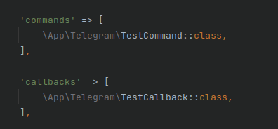

# Installation

    composer require kalexhaym/laravel-telegram-bot

# Publish config

    php artisan vendor:publish --tag=telegram-config

# Make Commands and Callbacks

    php artisan make:telegram-command Test
    php artisan make:telegram-callback Test

# Setup

After creating a Command or Callback, it must be registered in config/telegram.php

Add Telegram Bot token in .env

    TELEGRAM_TOKEN=

# Getting updates

There are two mutually exclusive ways of receiving updates for your bot - the getUpdates method
    
    php artisan telegram:poll-updates

and webhooks

    php artisan telegram:set-hook
