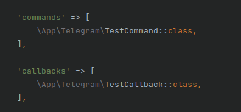

# Installation

    composer require kalexhaym/laravel-telegram-bot

# Publish config

    php artisan vendor:publish --tag=telegram-config

# Make Commands and Callbacks

    php artisan make:telegram-command Start
    php artisan make:telegram-callback Start

# Make Text Handler

    php artisan make:telegram-text-handler

# Setup

After creating a Command or Callback, it must be registered in config/telegram.php

Add Telegram Bot token in .env

    TELEGRAM_TOKEN=

# Getting updates

There are two mutually exclusive ways of receiving updates for your bot - the getUpdates method
    
    php artisan telegram:poll-updates

and webhooks

    php artisan telegram:set-hook

# Usage

Send a simple message

    $message->sendMessage('Hello, world!');

Send a simple message with keyboard

    use Kalexhaym\LaravelTelegramBot\Keyboard;

    $keyboard = (new Keyboard())
            ->inline()
            ->resizable()
            ->addButton('Test Callback', 'callback')
            ->addLink('Test Link', 'https://test.com');

    $message->setKeyboard($keyboard)->sendMessage('Hello, world!');

Send photo\
*Use this method to send photos.*

    use Kalexhaym\LaravelTelegramBot\Photo;

    $message->sendPhoto('https://test.com/photo.jpg');
    // OR
    $message->sendPhoto(new Photo('photo.jpg'));

Send Audio\
*Use this method to send audio files, if you want Telegram clients to display them in the music player.*

    use Kalexhaym\LaravelTelegramBot\Audio;

    $message->sendAudio('https://test.com/photo.mp3');
    // OR
    $message->sendAudio(new Audio('photo.mp3'));

Send Document\
*Use this method to send general files.*

    use Kalexhaym\LaravelTelegramBot\Document;

    $message->sendDocument('https://test.com/photo.pdf');
    // OR
    $message->sendDocument(new Document('photo.pdf'));

Send Video\
*Use this method to send video files, Telegram clients support MPEG4 videos (other formats may be sent as Document).*

    use Kalexhaym\LaravelTelegramBot\Video;

    $message->sendVideo('https://test.com/photo.mp4');
    // OR
    $message->sendVideo(new Video('photo.mp4'));

Send Animation\
*Use this method to send animation files (GIF or H.264/MPEG-4 AVC video without sound).*

    use Kalexhaym\LaravelTelegramBot\Animation;

    $message->sendAnimation('https://test.com/photo.gif');
    // OR
    $message->sendAnimation(new Animation('photo.gif'));

Send Voice\
*Use this method to send audio files, if you want Telegram clients to display the file as a playable voice message.\
For this to work, your audio must be in an .OGG file encoded with OPUS, or in .MP3 format, or in .M4A format (other formats may be sent as Audio or Document).*

    use Kalexhaym\LaravelTelegramBot\Voice;

    $message->sendVoice('https://test.com/photo.mp3');
    // OR
    $message->sendVoice(new Voice('photo.mp3'));

Send poll\
*Use this method to send a native poll.*

    use Kalexhaym\LaravelTelegramBot\Poll;

    // Regular poll
    $poll = (new Poll('Question', ['answer_1', 'answer_2']))
            ->allowsMultipleAnswers()
            ->notAnonymous();

    // Quiz
    $poll = (new Poll('Question', ['answer_1', 'answer_2']))
            ->quiz(0, 'Explanation')
            ->openPeriod(3600);

    $message->sendPoll($poll);
